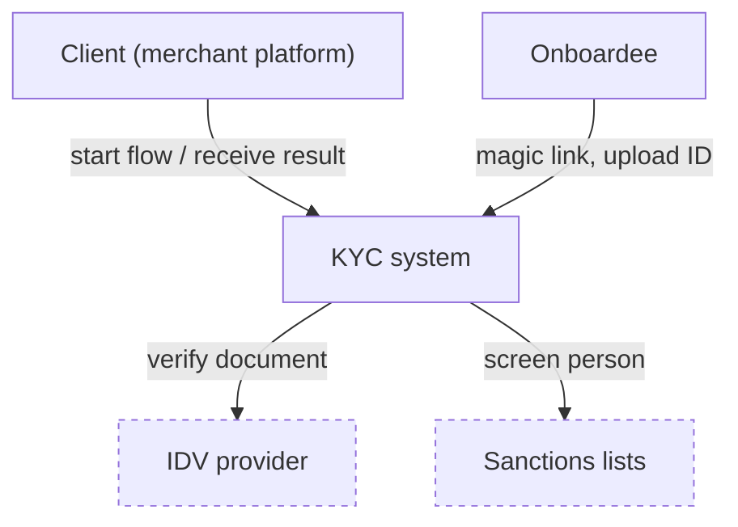
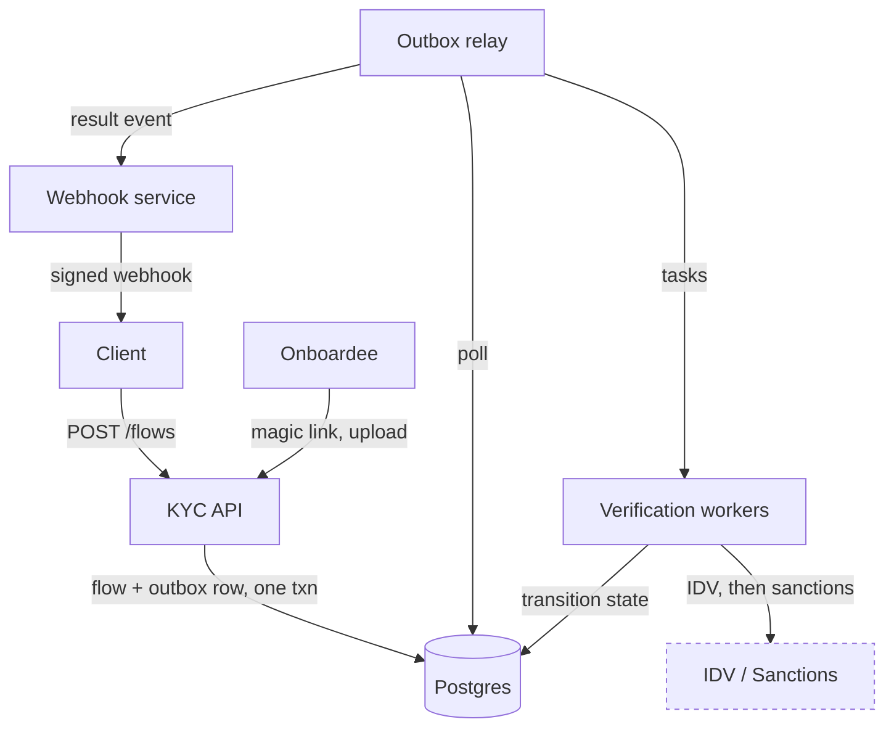
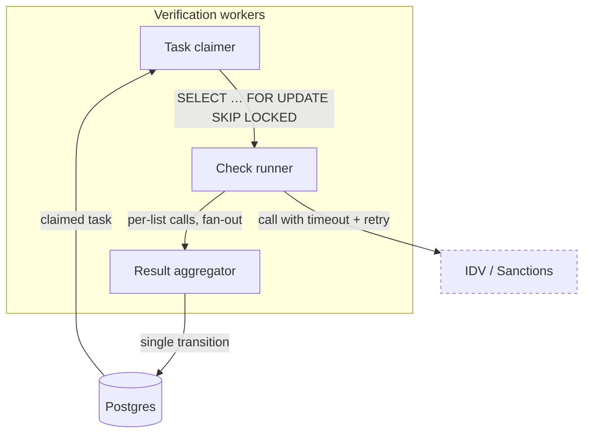
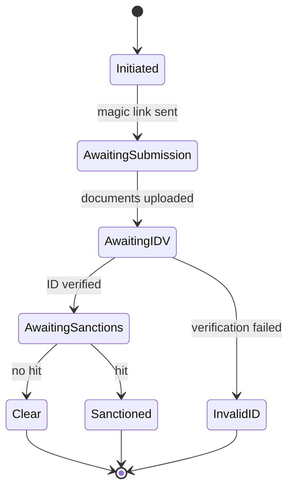

# The altitude ladder, worked

One system — a KYC/onboarding flow — drawn at four altitudes. Four small diagrams, never
one big one. The link between levels is the **shared node name**: `Verification workers`
at L1 is the same box zoomed at L2, `KycFlow` at L1's datastore is the entity whose
lifecycle L3 draws.

## L0 — context

*Question: who is involved, and what do we build vs call?* (5 nodes)

Everything dashed is given; the one solid box is the design. That is the whole point of
L0: it states the scope before any internals exist.

## L1 — containers

*Question: what runs, what stores, and where does every external call leave the system?*
(8 nodes — at the cap, which is why L2 exists)

The requirement rides on the edge label: "flow + outbox row, one txn" *is* the
write/publish-gap answer. A reader who covers the prose still sees why the outbox exists.

## L2 — zoom into one container

*Question: how do workers run checks concurrently without double-processing?*
The node keeps its L1 name — that is the zoom link.

Only this container is opened. `Postgres` and the external providers appear exactly as
they did at L1; nothing else from L1 is redrawn.

## L3 — dynamics

*Question: what states can a flow be in, and how does every path end?*

Three terminals, two of them failures. Sanctions is reachable only *after* IDV — the
sequencing requirement is in the graph shape, not in a footnote.

## Why four diagrams beat one

The merged version of these is ~20 nodes and answers no question crisply. Split by
altitude, each diagram stays under the cap, each caption names its question, and the
reader chooses their own depth — which is exactly how a design review (or an interview)
proceeds: breadth first, zoom on demand.
