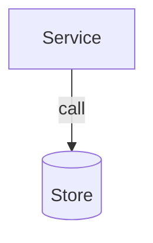

# Embedding diagrams in KB pages

Rules specific to the KB pages under `docs/`. Everywhere else, plain ```` ```mermaid ```` fences.

## Markup

````markdown

````

- One `mermaid` fence is one figure; the rest of the info string is `key=value` pairs
  ([KB-004](../../../../docs/reference/page-rules.md#KB-004)).
- Always give the `caption`; it is where the diagram's one question lives.
- `wide=true` lets a wide board use the full page width.
- A caption holding a backtick makes the fence open with `~~~`: a backtick fence cannot carry
  one in its info string.

## Constraints

- **Write the mermaid as it is** — `<<interface>>` and `&` need no escaping in a fence.
- **Drawn at build** — `make site-build` turns each fence into inline SVG (rehype-mermaid,
  headless Chromium). No script draws it in the browser, and no CDN or vendored engine is
  added: mermaid is an npm dependency of the site workspace.
- **No fills in `classDef`** — the site's diagram stylesheet colours nodes per theme; a
  hardcoded fill breaks dark mode.
- **No `click` callbacks, no HTML in labels** — a `click X "/route.html"` link to a page is
  the only click line; the build makes it relative.
- **KB-010** — a fence is a `mermaid` figure or a code sketch in a listed sketch language
  ([page rules](../../../../docs/reference/page-rules.md#KB-010)).

## Placement

- The `architecture` block carries the primary diagram — a `flowchart` for a distributed
  design, a `classDiagram` for a low-level kata. This is the L1 board.
- L2 zooms and L3 sequence/state diagrams belong in `deepdives`, one per deep dive — or
  an iterated evolution of the L1 board when an NFR forces a system-wide change (the
  zoom-or-iterate rule lives in [kb-design-architecture](../../kb-design-architecture/SKILL.md)).

## After editing

```
make gen && make validate
make site-build
node scripts/kb.mjs get <id> --block architecture
```

Run `make gen && make validate` after any edit under `docs/`, and `make site-build` to see the
diagram drawn; read the page back through the reader to confirm the block still extracts
cleanly.
