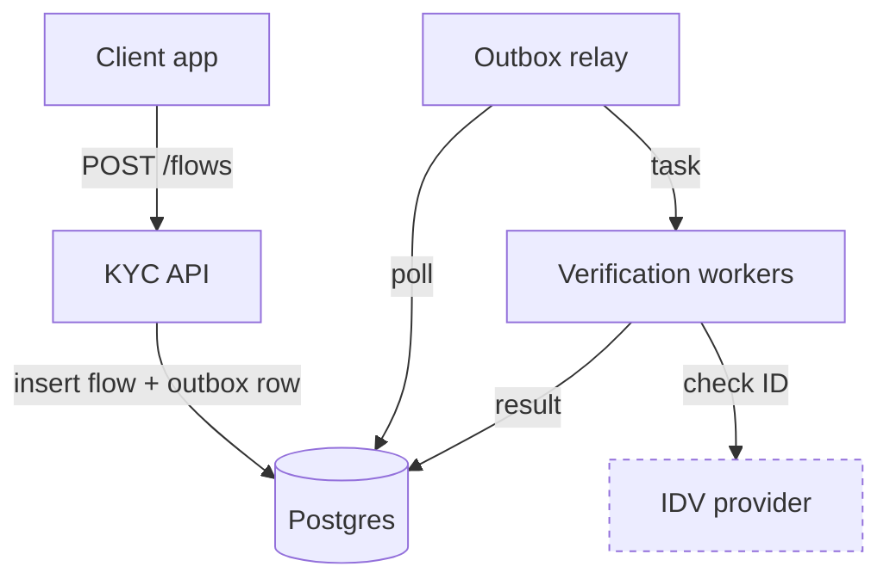
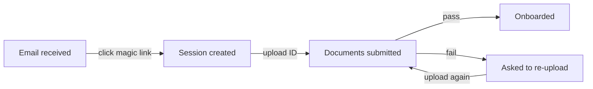
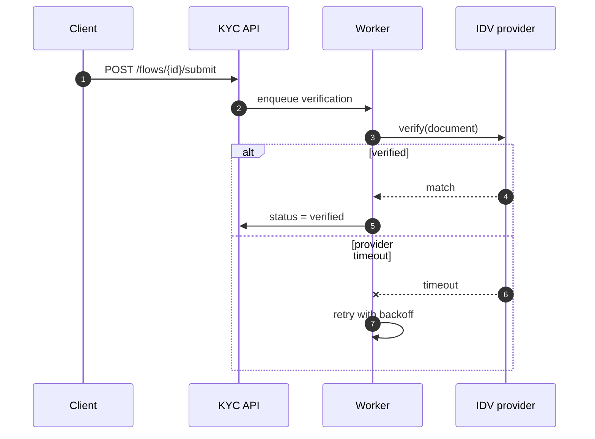
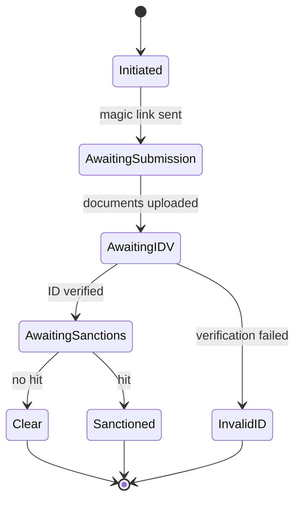
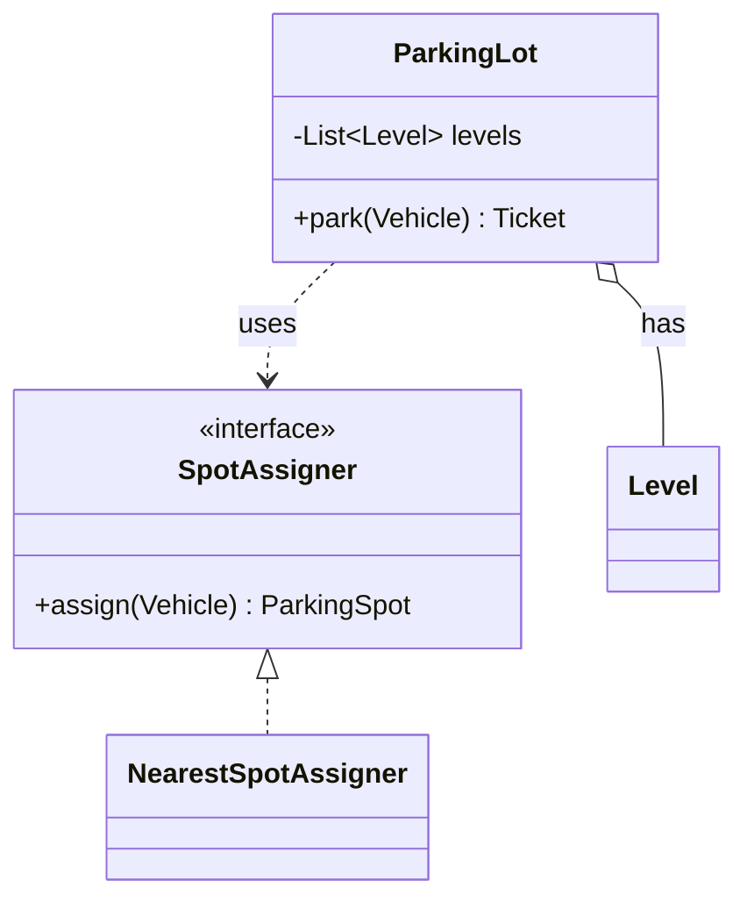

# Mermaid syntax — per-type cheat sheets and v11 gotchas

Canonical snippets in the house voice: quoted labels, labeled edges, no fills. Validated
against the vendored engine (mermaid v11.16.0, the one the site runs).

## flowchart TB — system architecture

- `TB` for architecture (layers read top-down); `LR` for user flows (time reads left-right).
- One `classDef ext` line at the bottom; attach with `:::ext` on first mention of the node.
- Cylinder `[("…")]` for datastores *and* queues — the label carries the difference.

## flowchart LR — user flow

- Nodes are *states the user is in*, edges are *what the user does*. Keep both in the
  user's vocabulary, not the system's.
- Show the unhappy branch; a flow with no failure edge is a demo, not a design.

## sequenceDiagram — one request's path

- `autonumber` always — the numbers are what prose and review comments cite.
- A deep-dive sequence without an `alt/else` failure branch usually is not answering the
  question; the failure ordering *is* the deep dive.
- `-->>` dashed for responses, `--x` for a lost/failed message.

## stateDiagram-v2 — entity lifecycle

- Every terminal — including failure terminals — reaches `[*]`. No orphan states.
- Transition labels name the *event*, not the next state.
- State names are PascalCase identifiers; use `State1: display name` if you need spaces.

## classDiagram — low-level design

- Generics use `~`: `List~Level~`, never angle brackets.
- `o--` aggregation, `*--` composition, `<|--` inheritance, `<|..` realization,
  `..>` dependency. Label associations (`: has`) — an unlabeled line is an unlabeled edge.
- Show only the members that carry the design decision; a full field list is noise.

## v11 gotchas

- **Quote any label** containing `(`, `)`, `/`, `:`, `,` or leading/trailing spaces:
  `["URL Fetchers"]`, `-->|"read / write"|`. Unquoted parens are parsed as shape syntax.
- **`stateDiagram-v2`**, never bare `stateDiagram` — v1 has different, worse layout.
- **`end` is reserved** in flowcharts — never a node id. Use `End`, `Done`, or rename.
- **No HTML in labels, no `click` callbacks** — the site runs `securityLevel: "strict"`.
  Plain text labels only; ` ` works in most renderers but avoid it: a label needing a
  line break is a label doing too much.
- **`classDef`: never set `fill`** — the site pulls colors from CSS variables per theme,
  and a hardcoded fill breaks dark mode. `stroke-dasharray`, `stroke-width` only.
- **Nested `subgraph`** needs its own `direction TB`/`direction LR` — it does not inherit
  from the parent flowchart.
- **Subgraph members count toward the node cap.** A subgraph is grouping, not compression.
