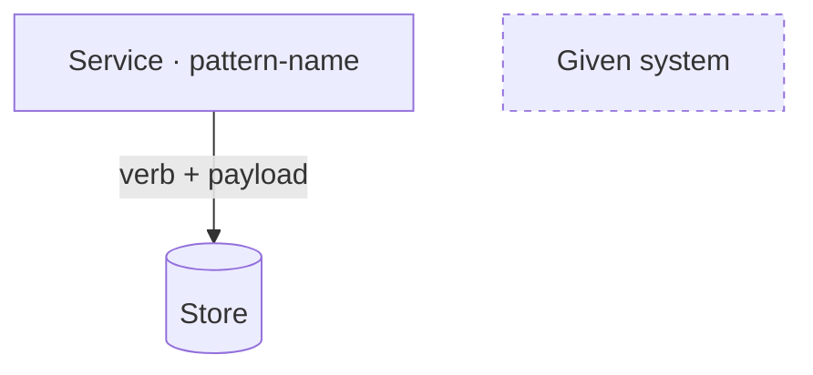

# Writing the architecture and deepdives blocks

**The architecture block proves the system satisfies every functional requirement; the
deep dives prove it satisfies every non-functional one — two blocks, one coverage
contract, and nothing on the board that neither proof needs.** This is the whiteboard
slice of the interview: the L1 board is drawn breadth-first so the whole system is
visible at once, and each deep dive zooms or iterates on demand, one NFR at a time.

## The markup

````markdown
## How the system is built
<!--meta block=architecture-->

Lead — entry point, the one structural decision, the flow at a glance.



### Components & communication {#architecture-h-components}

| Component | Role, and what it talks to |
| --- | --- |
| **Service** | Role in one clause; talks to Store with payload. Requests enter here. |

### Where each requirement lands — one line per functional requirement, in the requirements block's order {#architecture-h-trace}

**Requirement paraphrase → FR: label** {#arch-fr-1}

Component → Component path.

## Deep dives
<!--meta block=deepdives-->

### 1 · Mechanism title → NFR: label

**Thesis — why this mechanism satisfies this NFR.** Then the options argument…

**Step name — what it covers** {#deepdives-h-step-1}

… only where a labelled step introduces two or more paragraphs …

```mermaid caption="The dive's one question."
…L2 zoom (node keeps its L1 name) or iterated board…
```
````

Heading texts are exactly **"How the system is built"** and **"Deep dives"** (a suffix
naming the page's angle is allowed), each followed on the next line by its `block` fact.
Every diagram is a **fence of its own, never inside a list item or a table**: that keeps each
dive a self-contained prose+diagram pair that can be moved or reviewed as a unit, and the
fence's `caption=` is the diagram's one question. Both blocks are hand-written markdown — no
`kb.mjs` writer exists for them; the `kb-shape` gate checks structure
([KB-003](../../../docs/reference/page-rules.md#KB-003), [KB-010](../../../docs/reference/page-rules.md#KB-010)),
not content.

## The architecture shape

Lead, board, walk, trace — in that order.

### 1. Lead — entry point and the flow at a glance

One paragraph: where a request enters, the one structural decision that shapes everything
(a read/write split, an event-driven core, a single orchestrator), and the main flows in
a sentence each. The reader gets the whole answer here; the board is the proof.

### 2. The L1 board

One primary diagram: `flowchart TB` for a `system-design` page, `classDiagram` for a
`low-level-design` kata. How to draw it — node cap, edge labels, `:::ext` dashing — is
diagram-draw's contract (see below). What this skill adds is naming discipline: **every
node label must be a name the entities, interface or sizing blocks already use**, and
every node must reappear as a bullet in the components walk. A box that gets no bullet
is scope creep; a name the rest of the page never uses is a second vocabulary.

### 3. Components & communication

`### Components & communication {#architecture-h-components}` then a table, **one row per
board node**: `Component` names it,
`Role, and what it talks to` gives its role in one clause plus who it talks to and with
what payload. The first row names where requests enter.

**A table, not a list, because the roster is a lookup.** A reader arriving from the board
wants one node's row; a bullet list of ten `**Name** — 40-word clause` items
makes them scan every entry to find it. The rows carry the cross-block contract unchanged:
a store row names the entity it holds, a service row names the endpoints it serves, and the
payload wording reuses the interface block's verbs and status codes.

### 4. Where each requirement lands

`### Where each requirement lands {#architecture-h-trace}` then **exactly one section per
functional requirement, in the requirements block's order**: a run-in title — a paragraph
that is one bold span — carrying the requirement paraphrase and its routing tag
(`**Requirement paraphrase → FR: label** {#arch-fr-N}`), then a paragraph giving the
component path that satisfies it (Component → Component → Component). Write the id
`arch-fr-N` by hand; headings stop at H3 ([PAGE-002](../../../docs/reference/page-rules.md#PAGE-002)),
so the run-in title is the section.

The section shape is the same one `sizing` uses for a capability, and for the same reason:
the requirement, where it lands and how it is served are three things, and a bullet welds
them into one sentence the reader has to take apart. A page whose trace is a table keeps
the table — it separates the same three parts into columns.

The contract: every FR gets a line, and every line names only components that exist on
the board. An FR that traces to nothing is a missing box; a box no FR or NFR ever claims
is a box to delete. The trace lives in prose, not on the diagram, because `kb.mjs get`
strips diagrams by default — the coverage proof must survive extraction.

## The deep-dive shape

Each `###` in the deepdives block is one NFR argued to completion.

### One dive per NFR

Heading format: `### N · Mechanism title → NFR: label` — the numbered `N · Title` corpus
idiom, with the routing tag at the end of the heading, where the site sets it on its own
line beneath the title. The label matches the bold NFR label in the requirements block verbatim (Scale,
Latency, Availability, …). The contract: **every NFR appears in exactly one dive
heading.** A dive may carry two tags (`;`-joined) only when the two NFRs are genuinely
satisfied by one mechanism. Order the dives in the requirements block's NFR order unless
a dependency argues otherwise.

**The tag goes inside the heading — never in a paragraph of its own.** The build issues
`deepdives-dive-N` from each `###` in the block, in order, and the tag has to stay inside
the heading's text to survive `kb.mjs get`. A dive that carries no NFR — a scenario walk —
simply has no tag.

### Anatomy of one dive

Three moves, in order:

- **Open with a bold thesis** — one sentence on why this mechanism satisfies this NFR,
  so a reader who stops there still has the answer.
- **Argue the options** — the naïve one with the fact that kills it, the plausible rival
  with its cost, the chosen one with its residual weakness admitted. A dive with no
  rejected option is a lecture, not a decision.
- **Give the dive its own diagram** — zoom or iterate by the rule below; a dive that
  reuses the L1 board unchanged shows nothing the board did not already show.

**A long dive breaks into labelled steps, and a label that runs for two or more paragraphs
becomes a run-in title.** Where a dive argues an enumerated sequence — four idempotency
boundaries, six rungs of a recovery ladder — each step gets a paragraph that is one bold
span with a hand-written `deepdives-h-*` id, and the clause after its comma follows a dash
(`**Boundary one — the client's create** {#deepdives-h-boundary-1}`). A bold run-in that opens a *single* paragraph is a thesis sentence
and stays inline: promoting it would put a heading over every paragraph and rank nothing.

### Zoom or iterate — the diagram decision

- **Zoom (L2)** when the NFR is answered inside one box — the component's internals are
  the mechanism. The zoomed diagram keeps the node's **exact L1 name**: shared names are
  the only link between levels. Prefer the zoom whenever the component's internal design
  is reusable knowledge — a range-allocating id minter or a failover pair teaches beyond
  this page.
- **Iterate the board** when the NFR forces a system-wide change — new boxes or edges
  appear, so redraw the L1 with the delta carrying the emphasis.
- The test: if you can name the single L1 node that answers the NFR, zoom into it; if
  the answer is "several" or "the shape changes", iterate. When the NFR is about one
  request's dynamics — latency, ordering, failure timing — an L3 `sequenceDiagram` is
  the zoom.

## Pattern labels — board and prose

Components are labeled with the patterns they implement, in three layers that never mix:

- **On the board**: a node or subgraph that embodies a pattern carries the pattern's id
  as plain text after a middot inside the quoted label — `Cache[("Cache · cache-aside")]`
  — never a link (mermaid runs `securityLevel: "strict"`, and diagrams are stripped
  from extraction anyway).
- **In prose**: the sentence arguing the mechanism carries the real
  `[Name](../patterns/…/<id>.md)` link. A rejected alternative is named without a link —
  `demonstrates` means *uses*.
- **In the graph**: every prose-linked pattern gets a typed row via
  `node scripts/kb.mjs link <design> demonstrates <pattern>`; `kb.mjs refs <design>`
  flags any prose link with no typed relation.

Verify a pattern name before boarding it (`kb.mjs find`, `kb.mjs get <id> --block
usage`) — a wrongly named label is worse than no label. A pattern label with no FR or
NFR forcing that mechanism is decoration; drop it.

## Diagrams are diagram-draw's job

This skill owns *what each diagram is for and where it sits*; [diagram-draw](../diagram-draw/SKILL.md)
owns *how it is drawn* — the ~8-node/12-edge cap, verb+payload edge labels, `:::ext`
dashing with no fills, naming the requirement on the board, and how a fence carries its
caption. Read it before drawing; do not restate it here.

## Wording rules

The lead, the components walk and every dive thesis are prose, and the same five rules
bind all of them:

- **Second person, active voice.** Address the reader as "you" and open directives with
  the verb — "Route the read through the cache", not "the read is routed through".
- **One concept per sentence.** A sentence that needs "and which also" is two sentences,
  and the second one is the one the reader will miss.
- **Every claim carries its consequence.** Say what the component does, then what that
  costs or buys, in the same sentence or the next: a box described without its effect is
  a box nobody can argue with.
- **No unpriced adjectives.** "Robust", "scalable", "highly available" assert nothing —
  replace each with the figure, the mechanism, or the NFR that forces it.
- **Emphasis is bold, never italic.** `**bold**` for a run-in label, backticks for a
  component or column name, and no `*italic*` or `_italic_` anywhere — the corpus carries
  none. This holds for the pattern labels too, which are plain text
  next to the component name, exactly as the pattern-labels section says.

## Worked example

From `bitly` — the FR-coverage trace:

> ❌ *The store is a single relational instance with a read replica for failover.* — a
> replica box lands on the board, but no requirement ever claims it and no FR traces
> anywhere; the reader must trust that the boxes add up.

> ✅ *Visit a short URL and be redirected — `GET /{short_code}` enters at the edge; a
> miss falls through Read Service → Cache → URL store, and the answer is a 302.
> → FR: redirect.* — one line, one FR, a path of board names, and a status code
> the interface block can confirm.

The ❌ describes the system; the ✅ proves a requirement against it.

## Consistency with the rest of the page

Four contracts, checked side by side before shipping:

- **Names** — every board node appears in the entities, interface or sizing vocabulary;
  deepdive diagrams reuse the architecture board's labels exactly.
- **Sizing verdicts** — nothing sizing rejected may appear built on the board, and every
  capability sizing adopted has a box or an edge. When they disagree, the board is
  usually right and sizing missed a capability (see [kb-design-sizing](../kb-design-sizing/SKILL.md)).
- **Interface** — status codes, verbs and paths on diagrams match the interface block.
  Bitly shipped with a 302 argued in the interface and `301 redirect` drawn in the
  sequence diagram; the diagram is the copy nobody re-reads, so it drifts first.
- **Requirements** — dive tags and trace tags resolve to labels findable in the
  requirements block, verbatim.

## What this block is not

- **Not the sizing block.** Capabilities and numbers are decided there; here they become
  boxes and edges. No back-of-envelope arithmetic on the board.
- **Not a tech-stack listing.** A vendor name appears only where it *is* the mechanism
  (Redis's single-threaded atomic `INCR`), never as decoration.
- **Not a pattern catalogue.** Patterns earn their labels through the NFR that forces
  them; a board tiled with pattern names and no argument is the failure mode.

**Legacy note**: the corpus shape — one flowchart in architecture, prose dives, one
closing sequence diagram — stays valid until touched. This format is currently applied
to `bitly` and `persona-identification`. Migrate another page only when its design
blocks are being reworked on purpose.

## Done means

- The request flow can be reconstructed from the L1 board alone, prose covered
  (diagram-draw's silence test).
- Every FR has a line under "Where each requirement lands", and every NFR carries a
  dive heading tag — the check that does the work.
- Every board node has a components bullet, and every bullet's name appears in
  entities, interface or sizing.
- Every dive opens with a bold thesis, rejects at least one option, and carries its
  own diagram — a zoomed node keeps its exact L1 name.
- Pattern labels are middot text on the board and real links in prose, and
  `node scripts/kb.mjs refs <id>` shows no new untyped links.
- Diagram status codes and verbs match the interface block.
- `make gen && make validate` pass, and `node scripts/kb.mjs get <id> --block architecture`
  and `--block deepdives` (add `--diagrams` to review the boards) extract as: lead,
  walk, trace; then thesis, options, diagram per dive.
- Every dive's routing tag sits at the end of its `###` heading, never in a paragraph of
  its own, and every run-in step label covers two or more paragraphs rather than one.
